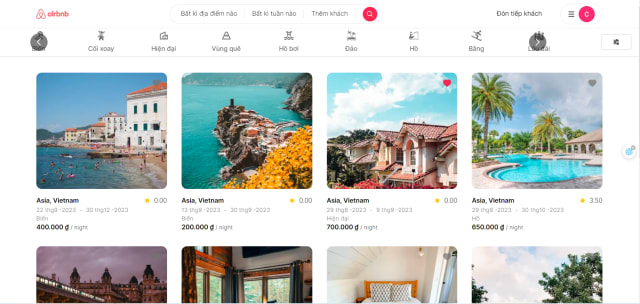
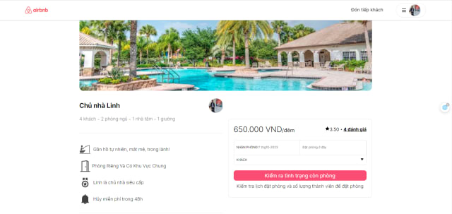
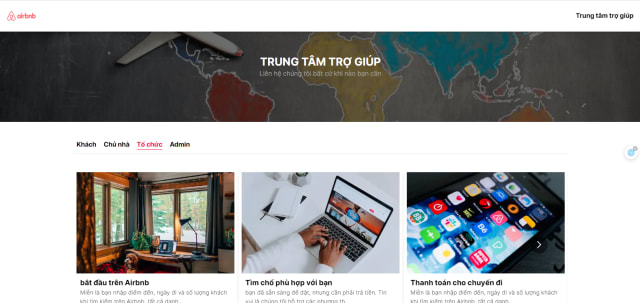
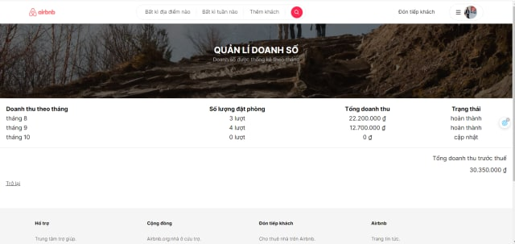
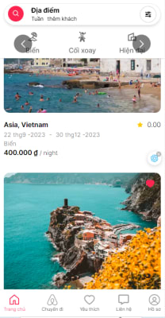
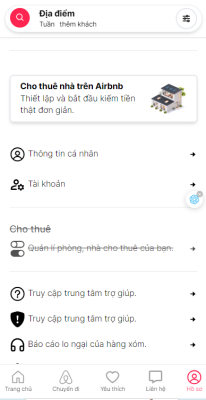
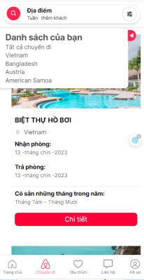

# MY AIRBNB CLONE



## Description
<p>Airbnb website is online maketplace to book and for rent. It's focus to two object, guest who want to use service and owner who want to sell service. In addition, you can save your trip, your favorite and read artical about travel,... </p>

## Tech Stack
  **Front-End**:HTML,CSS,SCSS,TypeScript,Tailwind,NextJS,Prisma,NextAuth,...
  **Database**:MongoDB

## Feature
1. **Guest**
    -  Register Account.
    -  Login with Google, Github,..
    -  Home page (view all room post by all owner, search, filter product by name, price, numeric, day,...)
    -  Detail page (view detail specific room and allow us reservation if enough condition, comment, share,...)
    -  Trip Page (show all your trip which you are booked, filter, sort)
    -  Favorite Page (show your favorite room, filter, sort)
    -  Manager Account Page (show account information, create or update account)
    -  Contact Us Page ( contain artical, help custome contact with us)
2. **Owner**
    -  Rent Page (allow owner create room for rent, create thier's information).
    -  Manager Page (manager thier's room)
    -  Sale page (manager monthly sales )

## Demo
Link : [![website]](https://airbnb-again.vercel.app/)
Video Demo : [Youtube](https://www.youtube.com/watch?v=9VzbYxKi_bY&t=2s)

## ScreenShots

 # Desktop
  - Detail each room

  

  - Contact Us Page

  

  - Manager Saling each month

   

 # Mobile
 
 
 
  

## Author
 - [Linh Thái](https://www.facebook.com/Linh201199)

## Run Locally
Clone the project

```bash
  git clone https://github.com/hlinh171038/airbnb-again.git
```
Go to project direction

```bash
  cd my-project
```

Install depedencies

```bash
  npm install
```

Start the server

```bash
  npm run dev
```

### Deloyment
To run this project, you must link your github repo to [vercel](https://vercel.com/).

### Feedback
If you have any feedback, please reach out to us at hoanglinh171038@gmail.com

